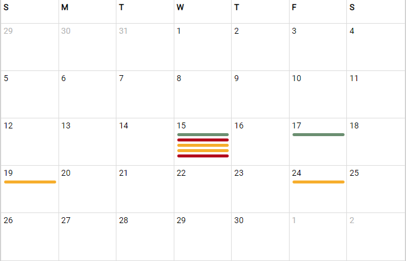
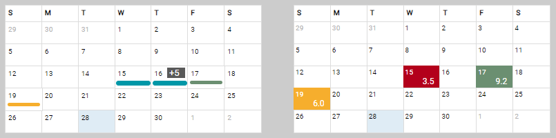

# KPI Calendar View
The KPI Calendar View is used to display a standard Month View Calendar with key performance indicators added to the desired days of the month. 

This documentation is appropriate for anyone wishing to use or modify the solution. 

Key Notes: 

- The Calendar is generated completely with CSS Grids.  This makes updating the look and feel much easier compared to HTML Table based systems. 
- This serves a very specific purpose which, again, will make maintenance and modifications easier.  You are not fighting features that are more in the way than helpful. 
- This solution uses jQuery; ensure that jQuery is loaded before the object is created. 

## Table of Contents

- [KPI Calendar View](#kpi-calendar-view)
  - [Table of Contents](#table-of-contents)
  - [Views](#views)
    - [Standard](#standard)
    - [Small](#small)
  - [DOM Structure](#dom-structure)
  - [Create Calendar View / Object](#create-calendar-view--object)
    - [Example](#example)
    - [Data Attributes](#data-attributes)
  - [Properties](#properties)
  - [Methods](#methods)
    - [setMonthDisplay(selector, format, callback)](#setmonthdisplayselector-format-callback)
      - [Example](#example-1)
    - [setMonth(month, year, callback)](#setmonthmonth-year-callback)
    - [addMonth(v, callback)](#addmonthv-callback)
    - [getISODate()](#getisodate)
    - [addItem(key, cssClass, title, text, color, uid)](#additemkey-cssclass-title-text-color-uid)
      - [Examples](#examples)
    - [resetItems()](#resetitems)

## Views 
There are 2 type of calendar views - standard and small.  This is as much a designation of purpose as it is size. 

### Standard
Uses the css class name *kpic-calendar*. Useful when you wish to display multiple indicators per calendar day (as many as will fit in the box). 



### Small 
Uses the css class name *kpic-calendar-sm*. This view is used when you have a single data item per calendar day, and can display optional text along with the kpi color. 



## DOM Structure 
The layout/structure of the Calendar DOM object is the same regardless of view.  This structure is generated in code, so modifications to the structure would require changes to the code.  You should attempt to modify the look and feel of the view using CSS code as much as possible. 

To modify the look and feel using CSS it is important to understand the structure of the DOM element.  The top container contains two rows, the header for the days of the week, and the calendar grid which will be either 35 or 42 boxes for each day from the Sunday on or before the 1st day of the month, to the Saturday on or after the last day of the month. 

The header consist of 7 boxes with an inner div for the day of the week. 

The grid consist of a box for each day in the display. This box will have a data element for the ISO date string and 2 inner elements:
- the day of the month
- a container for one or more kpi items

The kpi-items container will contain a div for each kpi item, its key components are
- optional hover over text of the KPI item 
- A css class name to govern the color and size of the kpi item 
- an optional inner div to contain visible text for the item. Typically usefuly for the small view as opposed to the standard view 

```html
<div class="kpic-calendar">
    <div class="kpic-header-row">
        <div class="kpic-box">
            <div class="kpic-dow-text">S</div>
        </div>
        <!-- snip -- repeated 6 more times for each day of the week-->        
    </div>
    <div class="kpic-grid">
        <!-- snip beginning of month-->>
        <div class="kpic-box" data-date="2022-06-01">
            <div class="kpic-date-text">1</div>
            <div class="kpic-data-items"> 
                <!-- a day of the month with a KPI item -->
                <div class="kpic-data-item kpic-data-item-default">
                    <div class="kpic-data-item-inner"></div>
                </div>
                <div class="kpic-data-item kpic-danger">
                    <div class="kpic-data-item-inner">5.4</div>
                </div>
            </div>
        </div>
        <!-- snip rest of the month, repeat to fill up 5 to 6 weeks -->
    </div>
</div>
```

## Create Calendar View / Object

Create an element to serve as the Calendar View container.  The container must have either the css class kpic-calendar or kpic-calendar-sm. In a script block instantiate the calendar object. The variable kpic is used in this documentation, but can be any valid javascript variable name.  This code will create a new object of type kpiCalendar.

### Example

```html
    <div id="kpic1" class="kpic-calendar"></div>
    <script>
        var kpic = new kpiCalendar('#kpic1');
    </script>
```

> note that  ``` new kpiCalendar('') ``` will try and use the first instance of an element of .kpic-calendar or .kpic-calendar-sm.

Once created, you will manipulate the view using public methods of the kpiCalendar object. You should avoid direct manipulation of the DOM Element. 

### Data Attributes 
Some data attributes may be used when creating the calendar object 
- truncateview 
```html
<div id="kpic2" class="kpic-calendar-sm" data-truncateview="0"></div>
``` 
Set the truncateview value to false. This will force the calendar view to always show 6 weeks.

- monthdisplay, monthformat 
```html
<div> small month = <span id="small-month-display"></span></div>
<div id="kpic2" class="kpic-calendar-sm" data-monthdisplay="#small-month-display" data-monthformat="short"></div>
```
For kpic2, set the element #small-month-display to receive the name of the month when it is changed, uses short format; Use long if monthformat is not specified. 
  

## Properties 
The calendar object will have the following public properties 

| Name | Type | Notes |
| ---- | ---- | ----- | 
| elem | jQuery Object | This is the jQuery object of the calendar vie. In our example ```jQuery('#kpic1") === kpic.elem``` | 
| activeDate | datetime object | The first day of the currently displayed month | 
| legendItems | array | An Array of object created by the addListItem method.  All kpi data items are stored in this array, so when a month view is built, the proper KPI items can be added to the view | 
| truncateView | boolean | Default is true, If "falsey" then show 7 weeks in the view, if true, then truncate the last week of sunday is the first day of the next month |


## Methods 

### setMonthDisplay(selector, format, callback)
Sets an element in your page to be updated when the month of the calendar view is changed. 

| Parameter | R/O | Default Value | Note |
| --------- | --- | --------- | --------- |
| selector | Required | n/a | any valid jQuery selector string.  When called the element will be updated immeidately with the current month |
| format | Optional | long | Uses date.toLocalString to return the month name. Valid values are : long \| short  |
| callback | Optional | n/a | Optional function to call after the month name has been updated.  This can also serve as a function to call anytime the month is changed. The current active date will be passed to the callback function. 

#### Example
When the month of the calendar object is changed then update the HTML date input object with the new value 
```html
<input type="date" id="testDateInput" name="testDateInput" value="">        
```
```javascript
lgc1.setMonthDisplay('.toolbar .current-month','long', function(d) {
    jQuery('#testDateInput').val(d.toISOString().slice(0,10));
});
``` 


### setMonth(month, year, callback)
Sets the current view to the specified month and year.  If month or year are blank or not valid, it will set the view to the current month. 

| Parameter | R/O | Default Value | Note |
| --------- | --- | --------- | --------- |
| month | Optional | current month | any integer from 0 to 11.  Months are -1 the current month; So Jan = 0; July=6, etc.  |
| year | Optional | current year | any integer > 2000;   If month OR year are not valid, sets the display to the current month
| callback | Optional | n/a | Optional function to call after the month is set. 

### addMonth(v, callback)
Calculates the new month based on the vector 'v' then calls the setMonth method with the new month and year.

| Parameter | R/O | Default Value | Note |
| --------- | --- | --------- | --------- |
| v | required | n/a | any integer, use a negative number to go backwards v number of months |
| callback | Optional | n/a | Optional function to call after the month is set. \

### getISODate()
Returns the active date as a string in the format yyyy-MM-dd - the day will always be the first of the month. 

```javascript
kpic.setMonth(6,2022);
var dstr = kpic.getISODate();
console.log(dstr);  // writes 2022-07-01 
```

### addItem(key, cssClass, title, text, color, uid)
Once the calendar object has been created, you can add kpi data elements. The minimum requirements is a ISO Date String value. 

| Parameter | R/O | Default Value | Note |
| --------- | --- | --------- | --------- |
| key       | Required | none | Date String in ISO Format yyyy-MM-dd |
| cssClass  | Optional | see below | css lass, if available, is used in addition to kpic-data-item-default, not instead of. Your custom css will typically set the background/border colors, and height of the kpi item in the standard view.  |
| title     | Optional | none | Added as the hover over title of the element |
| text      | Optional | none | Inserted as text in the kpic-data-item-inner element; Usable only for the small calendar view   |
| color     | Optional | none | The background/border color of the |
| uid       | Optional | none | A unique id (UUID) will be generated, but you may wish to pass in the UUID from a kendo dataSource. The code will not insert items with the same UUID.|

> The default css class name will be ***kpic-data-item kpic-data-item-default***.  When you supply a value for the cssClass parameter, it will be used in place of kpic-data-item-default ***kpic-data-item your-class***. 
>
> For more information review declarations for ***kpic-data-items*** in the *kpicalendar.scss* file.


the full method signature is : 
```javascript 
addItem(key, cssClass, title, text, color, uid)
```
#### Examples
```javascript 
lgc2.addItem('2022-07-20','kpic-success','','8.0');
lgc1.addItem('2022-06-15','','This is a default kpi item, you will see this text when you hover over.');
lgc1.addItem('2022-06-17','kpic-success');

switch (cssName) {
    case 'kpic-danger' : 
        lgc2.addItem(d, cssName, '', '3.2');
        break;
    case 'kpic-warning' :
        lgc2.addItem(d, cssName, '', '6.2');
        break;
    default : 
        lgc2.addItem(d, cssName, '', '8.2');
}
```


### resetItems()
Call to reset the calendar view, eliminating all data elements from the view and data structure. 
```javascript 
kpic.resetItems();
```

